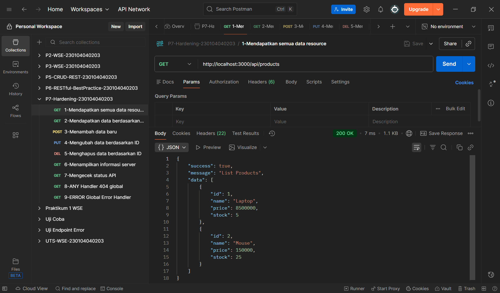
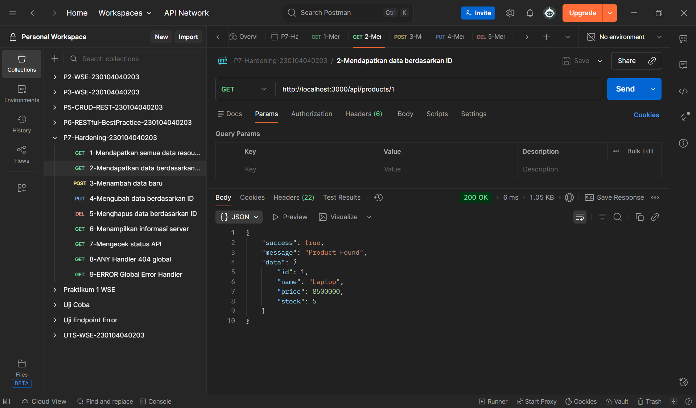
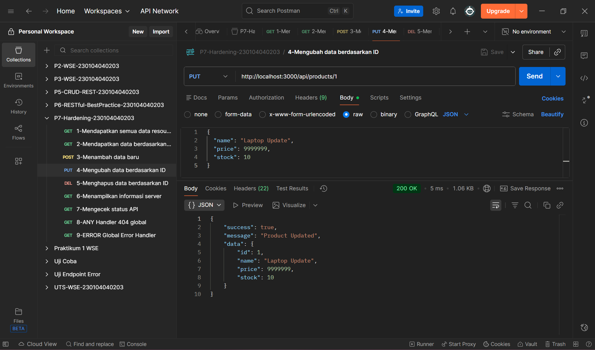
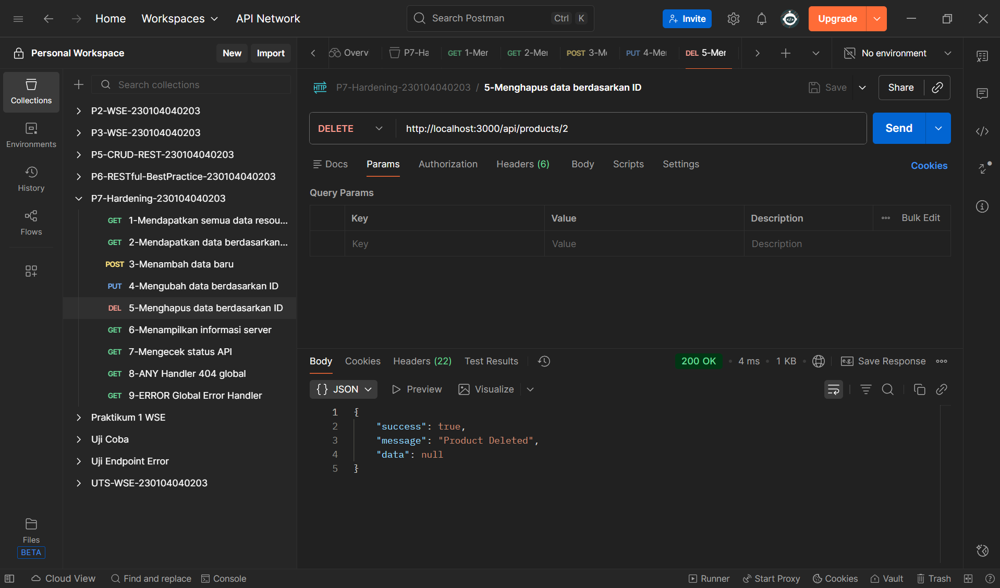
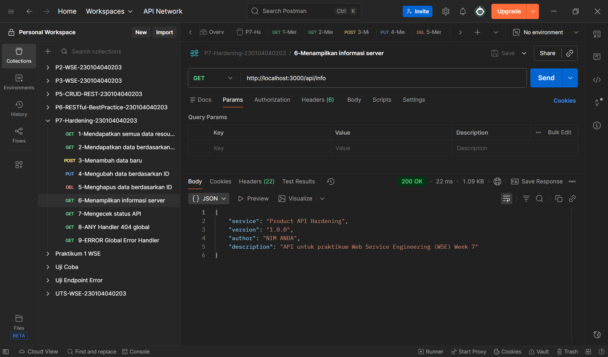
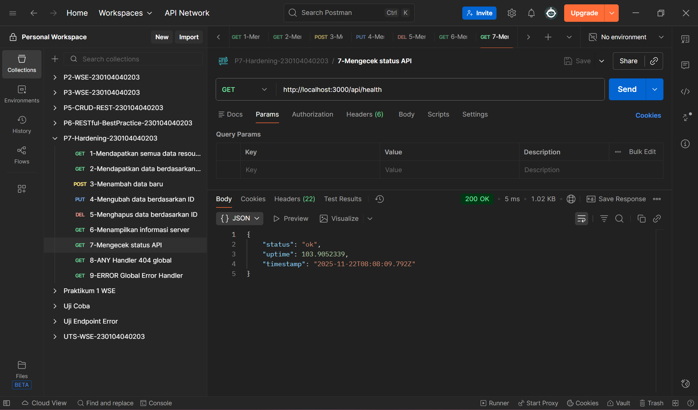
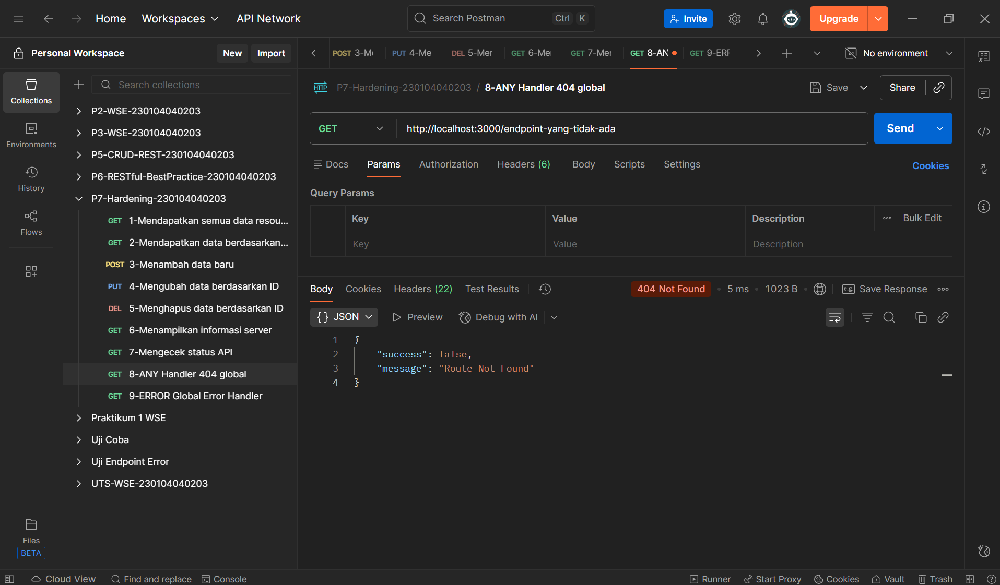
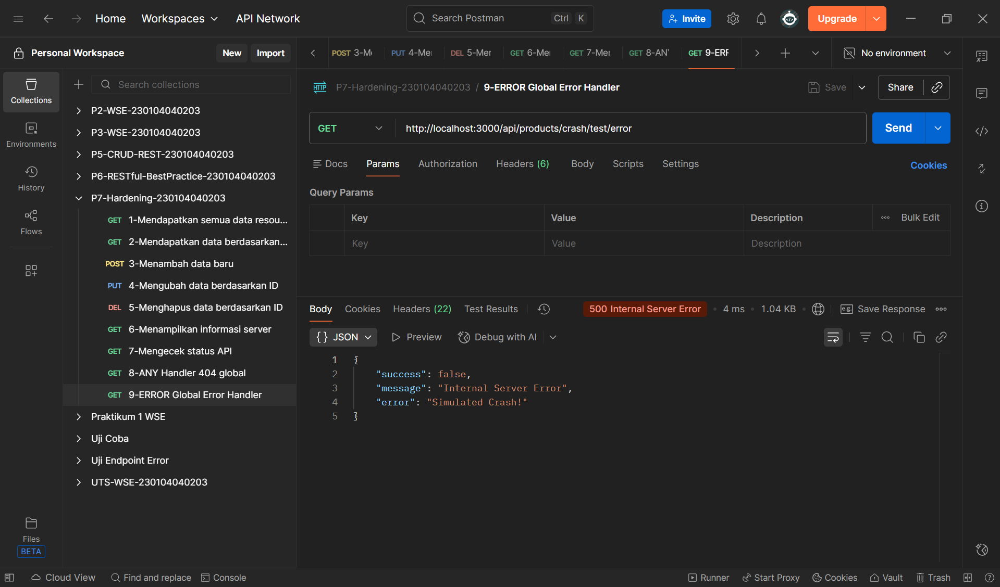

# PRAKTIKUM 7 — HARDENING RESTFUL API (Web Service Engineering)

### Nama  : Nor Hayati  
### NIM   : 230104040203
### Kelas : TI23A  
### Mata Kuliah : Web Service Engineering  
### Dosen Pengampu : MUHAYAT, S.Ag, MIT

---

# 📌 Tujuan Praktikum
Praktikum 7 bertujuan untuk menerapkan konsep **API Hardening** pada RESTful API menggunakan Express.js dengan menambahkan komponen keamanan, monitoring, dan error handling, seperti:

- Helmet → Security Headers  
- CORS → Pembatasan origin akses  
- Rate Limiting → Pencegahan spam & brute force  
- Morgan → Logging HTTP request  
- Error Handler → Standarisasi pesan error  
- Discoverability → `/api/info`  
- Observability → `/api/health` dan `/api/metrics`

Dengan implementasi ini, API menjadi lebih aman, stabil, dan mudah di-*maintain*.

---

# 📁 Struktur Direktori Project

```


P7-Hardening-230104040203
 ├── screenshots
 │     ├── 1.png
 │     ├── 2.png
 │     ├── 3.png
 │     ├── 4.png
 │     ├── 5.png
 │     ├── 6.png
 │     ├── 7.png
 │     ├── 8.png
 │     ├── 9.png
 ├── src
 │     ├── data
 │     │     └── products.data.js
 │     ├── middlewares
 │     │     └── errorHandler.js
 │     ├── routes
 │     │     └── products.routes.js
 │     ├── utils
 │     │     └── apiResponse.js
 │     └── app.js
 ├── .env
 ├── .env.example
 ├── package.json
 ├── package-lock.json
 └── README.md

```


---

# ⚙️ Dependency yang Digunakan

| Library | Fungsi |
|--------|--------|
| express | Web framework |
| helmet | Security headers |
| cors | Cross-Origin Resource Sharing |
| express-rate-limit | Membatasi jumlah request |
| morgan | HTTP request logger |
| dotenv | Manajemen environment variables |
| nodemon | Development auto-restart |

---

# 🚀 Cara Menjalankan API

## 1️⃣ Install dependency:
npm install

## 2️⃣ Jalankan server mode development:
npm run dev

## 3️⃣ Jalankan server mode production:
npm start

Server berjalan di:
http://localhost:3000/

---

# 📡 Endpoint API

## CRUD Produk

| Method | Endpoint | Deskripsi |
|--------|----------|-----------|
| GET | `/api/products` | Mendapatkan semua produk |
| GET | `/api/products/:id` | Produk berdasarkan ID |
| POST | `/api/products` | Menambah produk |
| PUT | `/api/products/:id` | Mengubah seluruh data |
| PATCH | `/api/products/:id` | Mengupdate sebagian |
| DELETE | `/api/products/:id` | Menghapus data |

## Observability & Discoverability

| Endpoint | Deskripsi | Output |
|----------|-----------|--------|
| `/api/info` | Metadata API | JSON |
| `/api/health` | Cek status server | JSON |
| `/api/metrics` | Penggunaan memori & uptime | JSON |

## Error Handling

| Jenis Error | Keterangan |
|-------------|------------|
| 404 Not Found | Route tidak dikenal |
| 500 Internal Server Error | Crash test atau kesalahan sistem |

---

# 📸 **Screenshot Hasil Uji Postman (Versi Tabel)**  
> 📌 Catatan:  
> Upload screenshot ke folder:  
> Lalu pastikan nama file sesuai.

| No | Endpoint & Deskripsi | Method | Screenshot |
|----|----------------------|--------|------------|
| 1 | **GET Semua Data** (`/api/products`) | GET |  |
| 2 | **GET by ID** (`/api/products/:id`) | GET |  |
| 3 | **POST Data Baru** (`/api/products`) | POST |  |
| 4 | **PUT Update Data** (`/api/products/:id`) | PUT |  ||
| 5 | **DELETE Data** (`/api/products/:id`) | DELETE |  |
| 6 | **Metadata API** (`/api/info`) | GET |  |
| 7 | **Health Check** (`/api/health`) | GET |  |
| 8 | **404 Not Found Test** (Route tidak dikenal) | ANY |  |
| 9 | **500 Error Handler Test** (Simulasi crash) | ERROR |  |

---

# 🧾 **Contoh Output JSON**

## `/api/info`
```json
{
  "service": "Product API Hardening",
  "version": "1.0.0",
  "author": "NIM ANDA",
  "description": "API untuk praktikum Web Service Engineering (WSE) Week 7"
}
```
## `/api/health`
```json
{
  "status": "ok",
  "uptime": 102.5,
  "timestamp": "2025-11-22T12:00:00Z"
}
```
✔️ Kesimpulan Praktikum

Dari praktikum ini, dapat disimpulkan bahwa:

✔ API dapat diperkuat menggunakan berbagai middleware modern
✔ Mekanisme logging, rate limit, dan security headers sangat penting
✔ Error handling terstruktur membuat API lebih profesional
✔ Endpoint observability membantu proses monitoring aplikasi
✔ API lebih aman dan tahan terhadap serangan dasar

Praktikum berhasil dilakukan dan seluruh endpoint berfungsi sesuai standar.

-----
